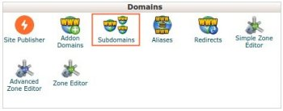
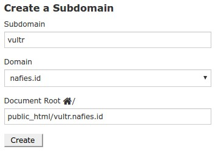
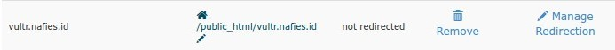
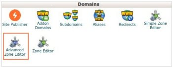
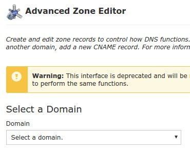
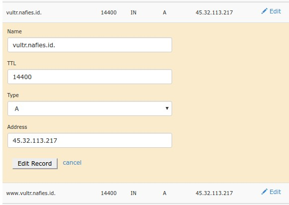
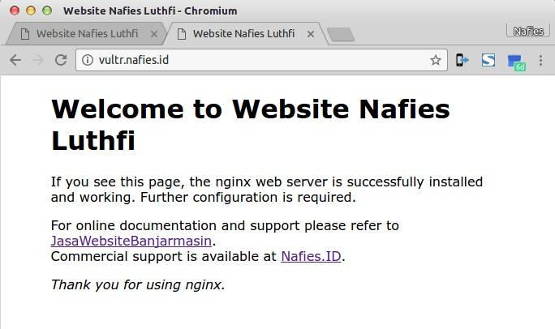

Pada artikel ini kita akan melakukan *mapping* agar *subdomain* dari sebuah website (dengan shared hosting) dapat digunakan pada server terpisah (dalam hal ini VPS).

## Kondisi
1. **Nameserver** Domain utama (misal: **nafies.id**) sudah diset ke hosting utama (shared hosting dengan cpanel).
2. Domain utama telah online (optional).
3. VPS telah dibuat dengan sebuah IP Address (misal: 45.32.113.217)
4. Web server pada VPS telah aktif (jika diakses melalui http://45.32.113.217)

    

## Langkah yang dilakukan
1. Login ke cpanel dari domain utama (shared hosting)
2. Buat subdomain baru (vultr.nafies.id)

    
    
    

3. Kemudian cari dan klik menu **Advanced Zone Editor**

    

4. Pilih domain utama (contoh.com)

    

5. Pada tabel **Zone File Records**, cari nama subdomain yang telah dibuat tadi (vultr.nafies.id)
6. Klik **Edit** pada *vultr.nafies.id*, muncul kotak dialog untuk *Edit Record*
7. Ubah **Address** menjadi IP Address VPS yang dituju **45.32.113.217**
8. Klik **Edit Record**

    

9. Lakukan **Edit Record** juga untuk subdomain *www.vultr.nafies.id*
10. Selesai pengaturan sampai disini.
11. Coba akses VPS melalui alamat baru (http://subdomain.contoh.com) melalui browser.

    

    Seharusnya akan tampil halaman yang sama dengan VPS yang diakses dengan IP Addressnya (http://45.32.113.217).

    > Jika halaman yang sama belum muncul, mungkin proses propagasi (pemindahan) belum selesai, umumnya memakan waktu maksimal 1x24 jam.
    >
    > Pada kasus saya, proses propagasi kurang dari 1 menit, alamat subdomain sudah menampilkan halaman web pada VPS.
